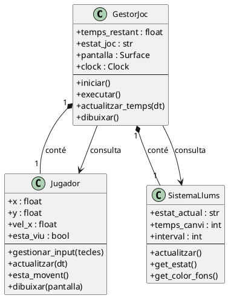
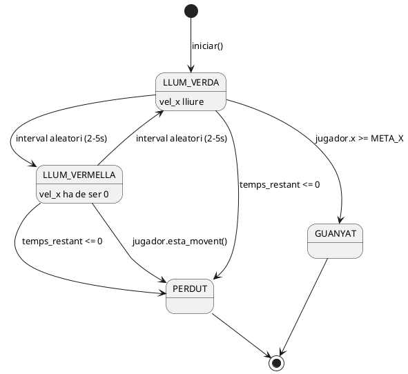

# 🗂️ Fase 2: Model del Joc
> **Projecte:** Space Run  
> **Entorn:** Python + Pygame

---

## 1. Components principals del joc

Space Run es compon de **3 classes Python** que coordinen tota la lògica:

| Classe | Fitxer | Responsabilitat principal |
|---|---|---|
| `GestorJoc` | `gestor_joc.py` | Controla el flux global, el temporitzador i el bucle principal |
| `Jugador` | `jugador.py` | Gestiona el moviment de l'avatar i detecta si es mou durant llum vermella |
| `SistemaLlums` | `sistema_llums.py` | Executa el bucle de canvis aleatoris de llum (verd ↔ vermell) |

El fitxer `main.py` instancia les tres classes i arrenca el joc.

---

## 2. Entitats identificades

### GestorJoc
Controlador central. Inicialitza Pygame, gestiona el bucle principal (`while running`), manté el temporitzador i decideix quan s'acaba la partida (victòria o derrota). Coordina les altres dues classes.

### Jugador
Representa l'avatar del jugador (rectangle de color). S'encarrega de processar les tecles (fletxes o WASD), aplicar el moviment i comprovar si es mou il·legalment durant la fase vermella.

### SistemaLlums
Gestiona l'alternança aleatòria entre estat VERD i VERMELL. Utilitza `pygame.time.get_ticks()` per mesurar el temps i canviar d'estat de manera independent dels FPS.

---

## 3. Atributs clau de cada entitat

### GestorJoc
| Atribut | Tipus | Descripció |
|---|---|---|
| `temps_restant` | `float` | Temps restant de partida en segons (120 → 0) |
| `estat_joc` | `str` | Estat actual: `"JUGANT"`, `"GUANYAT"` o `"PERDUT"` |
| `pantalla` | `pygame.Surface` | Superfície principal de Pygame on es dibuixa tot |
| `clock` | `pygame.time.Clock` | Controla els FPS del joc |

### Jugador
| Atribut | Tipus | Descripció |
|---|---|---|
| `x`, `y` | `float` | Posició actual del rectangle del jugador |
| `vel_x` | `float` | Velocitat horitzontal actual (0 = aturat) |
| `esta_viu` | `bool` | `False` quan el jugador mor |
| `amplada`, `alcada` | `int` | Dimensions del rectangle del jugador (px) |

### SistemaLlums
| Atribut | Tipus | Descripció |
|---|---|---|
| `estat_actual` | `str` | Estat de la llum: `"VERD"` o `"VERMELL"` |
| `temps_canvi` | `int` | Marca de temps (ms) del pròxim canvi d'estat |
| `interval` | `int` | Durada actual en ms, generada amb `random.randint(2000, 5000)` |

---

## 4. Accions, mètodes o funcions principals

### GestorJoc
- `iniciar()` — Inicialitza Pygame, crea la finestra i instancia `Jugador` i `SistemaLlums`
- `executar()` — Bucle principal: processa events, actualitza i dibuixa cada frame
- `actualitzar_temps(dt)` — Resta `dt` a `temps_restant`; si `<= 0` → `estat_joc = "PERDUT"`
- `dibuixar()` — Dibuixa fons, jugador, meta, temporitzador i indicador de llum

### Jugador
- `gestionar_input(tecles)` — Llegeix les tecles premudes i assigna `vel_x`
- `actualitzar(dt)` — Aplica `vel_x` a la posició `x`
- `esta_movent()` — Retorna `True` si `vel_x != 0`; usat per detectar moviment il·legal
- `dibuixar(pantalla)` — Dibuixa el rectangle del jugador amb `pygame.draw.rect`

### SistemaLlums
- `actualitzar()` — Comprova `pygame.time.get_ticks()`; si s'ha superat `temps_canvi` → canvia `estat_actual` i genera nou `interval`
- `get_estat()` — Retorna `estat_actual` (consultat per `GestorJoc` cada frame)
- `get_color_fons()` — Retorna el color de fons corresponent a l'estat actual

---

## 5. Explicació del diagrama de classes

El diagrama mostra les tres classes i les seves relacions:

- **`GestorJoc` conté `Jugador`**: el GestorJoc instancia el Jugador i el destrueix quan el joc acaba. Relació de **composició** (1 a 1).
- **`GestorJoc` conté `SistemaLlums`**: el GestorJoc instancia i controla el SistemaLlums. Relació de **composició** (1 a 1).
- **`GestorJoc` usa `Jugador` i `SistemaLlums`**: cada frame, `GestorJoc` consulta l'estat de la llum i el moviment del jugador per decidir si hi ha mort. Relació d'**associació**.

`GestorJoc` és el controlador central; `Jugador` i `SistemaLlums` no es coneixen entre ells directament.

---

## 6. Explicació del diagrama de comportament

S'ha triat un **diagrama d'estats** perquè el joc es basa en dos estats visuals que determinen totes les regles en cada frame:

- **LLUM_VERDA** i **LLUM_VERMELLA** s'alternen aleatòriament mentre el joc és actiu.
- Des de **LLUM_VERDA**: si el jugador arriba a la meta → **GUANYAT**.
- Des de **LLUM_VERMELLA**: si el jugador es mou (`vel_x != 0`) → **PERDUT**.
- Si `temps_restant <= 0` des de qualsevol estat actiu → **PERDUT**.
- **GUANYAT** i **PERDUT** són estats finals: el joc es congela i mostra la pantalla de resultat.

---

## 7. Correspondència entre diagrames i codi futur

| Element del diagrama | Implementació a Python/Pygame |
|---|---|
| `GestorJoc.executar()` | `while running:` amb `clock.tick(60)` |
| `SistemaLlums.actualitzar()` | `if pygame.time.get_ticks() >= self.temps_canvi:` |
| `Jugador.esta_movent()` | `return self.vel_x != 0` |
| Transició LLUM_VERDA → LLUM_VERMELLA | Canvi de `estat_actual` + nou color de fons |
| Comprovació mort | `if llums.get_estat() == "VERMELL" and jugador.esta_movent():` |
| Victòria | `if jugador.x >= META_X:` |

---

## 8. Estructura inicial del repositori

```
space-run/
├── README.md
├── main.py                    ← Punt d'entrada del joc
├── src/
│   ├── gestor_joc.py          ← Classe GestorJoc
│   ├── jugador.py             ← Classe Jugador
│   └── sistema_llums.py       ← Classe SistemaLlums
├── docs/
│   ├── 01_idea_i_abast.md
│   ├── 02_model_del_joc.md
│   └── diagrames/
│       ├── diagrama_classes.png
│       └── diagrama_comportament.png
└── IA_log.md
```

---

## 9. Primer commit i README inicial

**Missatge del primer commit:**
```
init: estructura inicial del projecte i documentació fases 1 i 2
```

**Contingut del `README.md` inicial:**

```markdown
# Space Run 🚀

Microvideojoc de reacció ràpida desenvolupat amb Python i Pygame.

## Descripció
Travessa el passadís espacial fins a la càpsula d'escapament.
Atura't quan la llum sigui VERMELLA. Qualsevol moviment = mort instantània.

## Regles
- 🟢 Llum VERDA: pots avançar
- 🔴 Llum VERMELLA: atura't completament
- ⏱️ Tens 120 segons per arribar a la meta

## Instal·lació
pip install pygame
python main.py

## Tecnologies
- Python 3
- Pygame
- GitHub

## Estat del projecte
Fase 2 completada: model del joc i diagrames UML.
```

---

## 📊 Codi PlantUML per exportar com a PNG

### Diagrama de classes (`diagrama_classes.puml`)



### Diagrama d'estats (`diagrama_comportament.puml`)



> 💡 Renderitza a [PlantUML Online](https://www.plantuml.com/plantuml/uml/) i exporta com a PNG a `docs/diagrames/`.